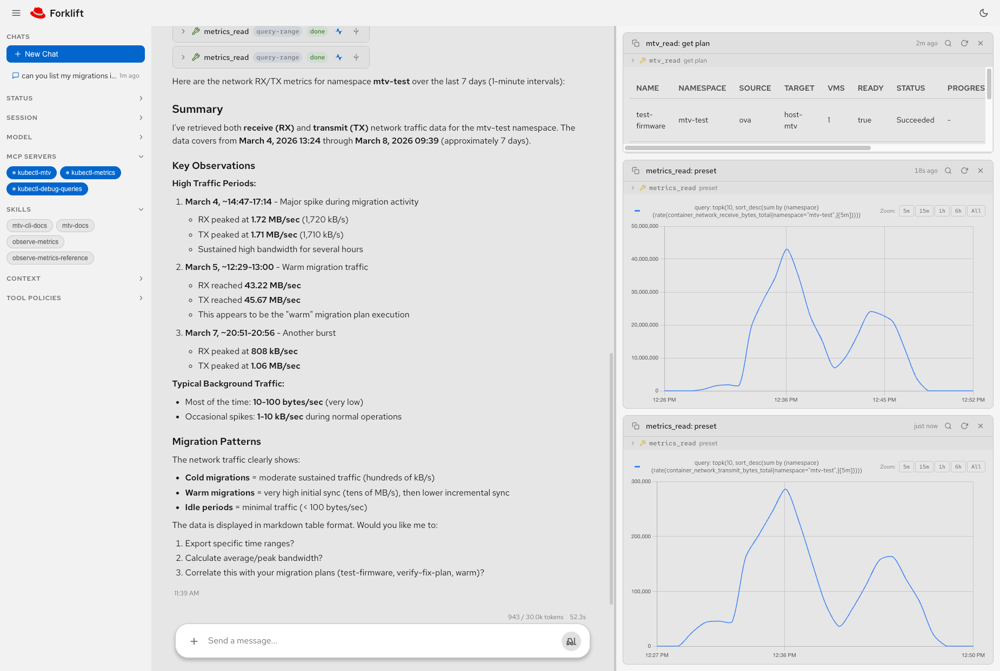

# mtv-agent

AI agent for [MTV/Forklift](https://github.com/kubev2v/forklift) VM migrations,
with a tool loop, MCP tool integration, and markdown-based skills and playbooks.

<div align="center">
  
  <p><em>mtv-agent v0.1.0 — chat interface with live migration metrics and plan status</em></p>
</div>

## Quick start

```bash
pip install mtv-agent
mtv-agent init
```

Then start the agent. You need:

- **An LLM backend**\* -- a local model, a remote API, or Claude CLI
- **Cluster access**\*\* -- logged in with `oc login` or configured `kubectl`,
  or explicit credentials (see below)
- **Docker or Podman**\*\*\* -- used by `mtv-agent start` to run the MCP server
  containers that give the agent access to your cluster

\*LLM backend can be: a locally running model via an OpenAI-compatible server
(e.g. LM Studio) configured in `~/.mtv-agent/config.json`; a remote LLM
service with an API key (e.g. OpenAI, Together, Groq); or a local
[Claude Code](https://docs.anthropic.com/en/docs/claude-code) install used
via `--with-cop`.

\*\*A valid service-account or user token is required. A kubeconfig without a
valid token will not be able to connect to the cluster.

\*\*\*Not needed if you run the MCP servers yourself and use `mtv-agent serve`
instead.

If your kubeconfig is already set up, just run:

```bash
mtv-agent start             # with LM Studio (default)
mtv-agent start --with-cop  # with Claude
```

You can also pass the API URL and token directly:

```bash
mtv-agent start --kube-api-url https://api.cluster.example.com:6443 \
                --kube-token "sha256~aBcDeFgHiJkLmNoPqRsTuVwXyZ..."
```

Or use environment variables:

```bash
export KUBE_API_URL=https://api.cluster.example.com:6443
export KUBE_TOKEN=$(oc whoami -t)
mtv-agent start
```

Open `http://localhost:8000` in your browser.

For the full walkthrough, see:

- [docs/installation.md](docs/installation.md) -- prerequisites, install,
  and workspace setup
- [docs/quickstart.md](docs/quickstart.md) -- step-by-step guide from zero
  to running agent
- [docs/llm-backends.md](docs/llm-backends.md) -- LM Studio and Claude setup
- [docs/development.md](docs/development.md) -- contributor setup, dev
  workflows, and project structure
- [web/README.md](web/README.md) -- web UI architecture, components, and
  frontend development

## CLI reference

```
mtv-agent init   [--dir DIR] [--force]
mtv-agent start  [--with-cop] [--runtime docker|podman] [--host HOST] [--port PORT]
                 [--config PATH] [--no-web]
                 [--kube-api-url URL] [--kube-token TOKEN]
                 [--kubeconfig PATH] [--kube-context NAME]
mtv-agent serve  [--host HOST] [--port PORT] [--config PATH] [--no-web]
mtv-agent stop
mtv-agent config
```

| Command | Description |
|---|---|
| `init` | Create a workspace at `~/.mtv-agent/` with config, skills, and playbooks |
| `start` | Start MCP containers, optional LLM proxy, and the API server |
| `serve` | Start only the API server (MCP/LLM must be running separately) |
| `stop` | Stop MCP containers and claude-openai-proxy |
| `config` | Print default config.json to stdout |

### Cluster credentials (for `start`)

The `start` command needs a Kubernetes API URL and bearer token to pass to the
MCP containers. These are resolved in priority order:

1. **CLI flags**: `--kube-api-url` and `--kube-token`
2. **Environment variables**: `KUBE_API_URL` and `KUBE_TOKEN`
3. **Kubeconfig**: the current context from `~/.kube/config` (or `$KUBECONFIG`)

Use `--kubeconfig` to point at a specific file, and `--kube-context` to select
a context other than the current one.

If you've logged in with `oc login` or configured `kubectl`, no flags or
environment variables are needed -- the agent picks up credentials from your
kubeconfig automatically.

## Configuration

All settings live in a single `config.json` file. After running `mtv-agent init`,
your config is at `~/.mtv-agent/config.json`. The agent searches for a config in this
order: `CONFIG` env var, then `./config.json`, then `~/.mtv-agent/config.json`.

To print the default config (useful for piping or inspection):

```bash
mtv-agent config
```

```json
{
  "llm": {
    "baseUrl": "http://localhost:1234/v1",
    "apiKey": "lm-studio",
    "model": null
  },
  "server": {
    "host": "0.0.0.0",
    "port": 8000
  },
  "mcpServers": {
    "kubectl-mtv": {
      "url": "http://localhost:8080/sse",
      "image": "quay.io/yaacov/kubectl-mtv-mcp-server:latest"
    },
    "kubectl-metrics": {
      "url": "http://localhost:8081/sse",
      "image": "quay.io/yaacov/kubectl-metrics-mcp-server:latest"
    },
    "kubectl-debug-queries": {
      "url": "http://localhost:8082/sse",
      "image": "quay.io/yaacov/kubectl-debug-queries-mcp-server:latest"
    }
  },
  "skills": { "dir": "~/.mtv-agent/skills", "maxActive": 3 },
  "playbooks": { "dir": "~/.mtv-agent/playbooks" },
  "memory": { "maxTurns": 20, "ttlSeconds": 3600, "toolResultLimit": 4000 },
  "agent": {
    "contextWindow": 30000,
    "maxIterations": 20,
    "maxRetries": 2,
    "retryDelay": 2.0
  }
}
```

Every value can be overridden by an environment variable (no prefix needed):

| Variable | Config key | Default | Description |
|---|---|---|---|
| `LLM_BASE_URL` | `llm.baseUrl` | `http://localhost:1234/v1` | OpenAI-compatible endpoint |
| `LLM_API_KEY` | `llm.apiKey` | `lm-studio` | API key for the LLM server |
| `LLM_MODEL` | `llm.model` | auto-discovered | Model name (queries `/v1/models` if unset) |
| `SERVER_HOST` | `server.host` | `0.0.0.0` | API server bind address |
| `SERVER_PORT` | `server.port` | `8000` | API server port |
| `SKILLS_DIR` | `skills.dir` | bundled skills | Directory containing skill definitions |
| `PLAYBOOKS_DIR` | `playbooks.dir` | bundled playbooks | Directory containing playbooks |
| `MAX_ACTIVE_SKILLS` | `skills.maxActive` | `3` | Maximum skills active at once |
| `MEMORY_MAX_TURNS` | `memory.maxTurns` | `20` | Conversation turns kept per session |
| `MEMORY_TTL_SECONDS` | `memory.ttlSeconds` | `3600` | Seconds before a session is evicted |
| `CONTEXT_WINDOW` | `agent.contextWindow` | `30000` | Default context window (overridden if auto-detected) |
| `MAX_ITERATIONS` | `agent.maxIterations` | `20` | Maximum tool-loop iterations |
| `MAX_RETRIES` | `agent.maxRetries` | `2` | LLM request retries on failure |
| `RETRY_DELAY` | `agent.retryDelay` | `2.0` | Seconds between LLM retries |

## Architecture

`mtv-agent start` manages five components:

| Component | Port | Description |
|---|---|---|
| API server | 8000 | FastAPI app serving the chat API and web UI |
| kubectl-mtv MCP | 8080 | MTV/Forklift resource queries and mutations |
| kubectl-metrics MCP | 8081 | Prometheus/Thanos metric queries |
| kubectl-debug-queries MCP | 8082 | Kubernetes resources, logs, and events |
| claude-openai-proxy | 1234 | Claude-to-OpenAI adapter (only with `--with-cop`) |

The MCP containers are managed automatically. If you run them yourself,
configure their URLs in `config.json` under `mcpServers`.

## Skills and playbooks

`mtv-agent init` copies the default skills and playbooks into `~/.mtv-agent/` so
you can edit or extend them.

**Skills** are markdown reference guides the agent loads on demand. Each skill
lives in `~/.mtv-agent/skills/<name>/SKILL.md` with YAML frontmatter (`name`,
`description`) and instruction body.

**Playbooks** are task-oriented markdown files exposed in the web UI. They
live in `~/.mtv-agent/playbooks/`. Override the directory with `SKILLS_DIR` or
`PLAYBOOKS_DIR`.

## API

All API endpoints are served under the `/api` prefix.

### `POST /api/chat`

Non-streaming. Returns the complete answer as JSON.

```bash
curl -X POST http://localhost:8000/api/chat \
  -H "Content-Type: application/json" \
  -d '{"message": "hello"}'
```

Request body:

| Field | Type | Description |
|---|---|---|
| `message` | string | The user message (required) |
| `session_id` | string | Session ID for conversation history (auto-generated if omitted) |
| `skills` | string[] | Skill names to activate |
| `context` | object | Key-value context pairs (e.g. `{"namespace": "default"}`) |

### `POST /api/chat/stream`

Streaming. Emits SSE events as the agent works. Add `?approve=true` to require
manual approval before each tool execution.

SSE event types:

| Event | Description |
|---|---|
| `session` | `{"session_id": "..."}` |
| `thinking` | Agent is waiting for the LLM |
| `usage` | Token usage: `total_tokens`, `prompt_tokens`, `completion_tokens`, `context_window` |
| `tool_call` | Tool about to run: `name`, `arguments` |
| `tool_result` | Tool finished: `name`, `result` |
| `tool_denied` | Tool denied by user: `name`, `reason` |
| `skill_selected` | Skill activated: `name` |
| `skill_cleared` | All skills deactivated |
| `context_set` | Context updated: `key`, `value` |
| `context_unset` | Context key removed: `key` |
| `content` | Final assistant response text |
| `done` | Stream complete, includes final `content` |

### `POST /api/chat/{session_id}/approve`

Push an approval decision for a pending tool call (used with `?approve=true`).

```json
{"approved": true}
```

Or deny with an optional reason:

```json
{"approved": false, "reason": "too dangerous"}
```

### `GET /api/status`

Returns model, MCP servers, tool count, context window, and max active skills.

### `GET /api/models`

Lists models available on the LLM server.

### `PUT /api/model`

Hot-swap the active model: `{"model": "model-name"}`.

### `GET /api/skills`

Lists available skills with names and descriptions.

### `GET /api/playbooks`

Lists available playbooks with metadata and body.

### `GET /api/mcp`

Lists all configured MCP servers with their connection status.

### `POST /api/mcp/{name}` / `DELETE /api/mcp/{name}`

Connect or disconnect an MCP server by name.

## Development

See [docs/development.md](docs/development.md) for contributor setup,
dev workflows, make targets, and project structure.
